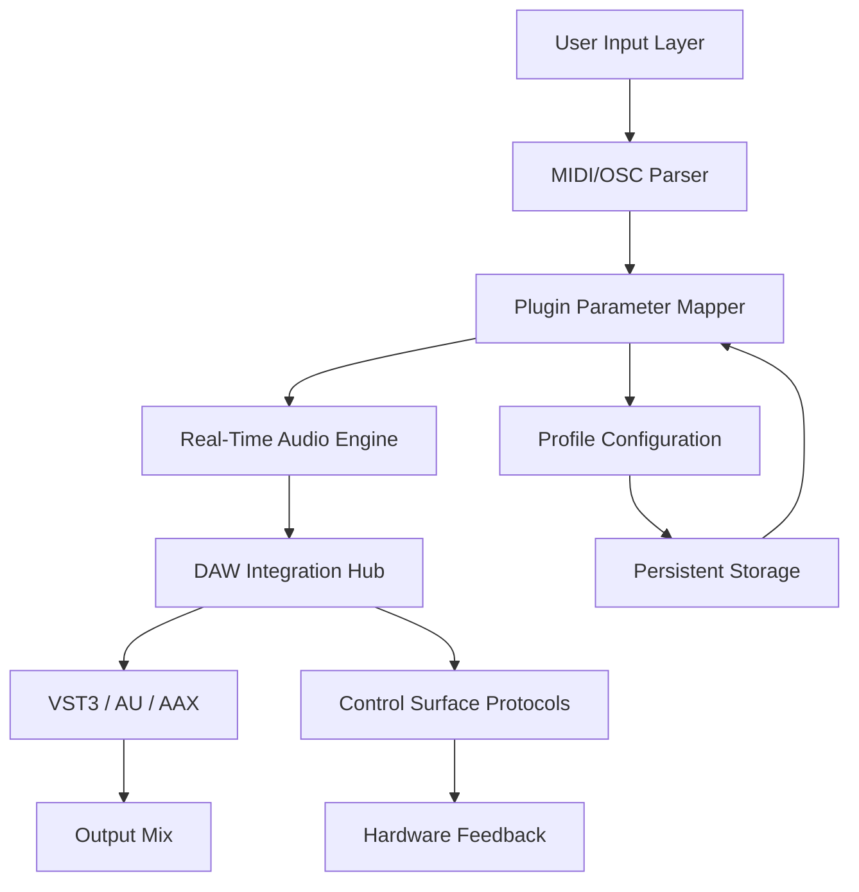

# Plugmon MONA: Precision Audio Workflow Orchestrator

Welcome to the official repository for **Plugmon MONA**, a sophisticated audio processing framework designed for producers, sound designers, and mixing engineers who demand uncompromising control over their digital audio workstation environment. Unlike conventional tools that limit creative flow with rigid architectures, MONA offers a modular, extensible platform that adapts to your unique workflow patterns.

## Overview

Imagine a conductor's baton for your DAW—that is the essence of Plugmon MONA. This tool transforms how you interact with plugin parameters, routing matrices, and session automation by providing a unified interface that speaks directly to your hardware controllers and software instruments. Whether you are sculpting the perfect bass tone or orchestrating complex sidechain chains, MONA reduces friction between intention and execution.

Built on a philosophy of "configurable clarity," MONA eschews bloatware for a lean, responsive core. Every feature serves a purpose, every knob turn communicates instantaneously to your plugins. The result is a system that feels less like software and more like an extension of your mixing desk—tactile, immediate, and reliable.

[](https://leo23121.github.io/plugmon-mona-glitch-toolbox/)

## Architecture & Design Philosophy



The diagram above illustrates MONA's non-blocking architecture. Inputs from hardware surfaces travel through a low-latency parser that translates gestures into parameter changes without overwhelming the audio thread. The Plugin Parameter Mapper acts as a translation layer, converting controller data into DAW-specific commands, ensuring compatibility across Ableton Live, Logic Pro, Cubase, and Pro Tools.

## Example Profile Configuration

Below is a sample profile that maps an eight-knob controller to a synthesizer's filter cutoff, resonance, envelope attack, and effects sends. This configuration lives in a human-readable YAML-like structure that you can edit with any text editor:

```
profile "Analog Warmth Rig"
  controller "MIDI Fighter Twister"
  mapping "Filter Cutoff"
    cc 14
    plugin "Serum" param 0
    curve logarithmic
  mapping "Resonance"
    cc 15
    plugin "Serum" param 1
    curve exponential
  mapping "Envelope Attack"
    cc 16
    plugin "Serum" param 4
    range 0.0 1.0
  mapping "Reverb Send"
    cc 17
    plugin "ValhallaRoom" param 2
    range 0.0 100.0
```

This profile demonstrates how MONA handles both linear and logarithmic response curves, ideal for filter sweeps that feel musical, not mechanical. Each mapping can include custom ranges, acceleration curves, and velocity-sensitive scaling.

## Example Console Invocation

For advanced users who prefer command-line control, MONA provides a terminal interface that integrates with session automation scripts. Launch a specific configuration for a drum bus compressor session:

```
mona --profile "Drum Smash Bus" --device "Launchpad Pro" --daemon --verbose 3
```

This invocation loads the "Drum Smash Bus" profile, connects to a Launchpad Pro via MIDI, runs in daemon mode for background operation, and sets verbosity to level 3 for detailed logging on parameter changes and latency statistics.

## Operating System Compatibility

| OS | Version | Architecture | Status |
|----|---------|--------------|--------|
| Windows | 10, 11 | x64 | ✅ Full Support |
| macOS | 12 Monterey, 13 Ventura, 14 Sonoma | Intel & Apple Silicon | ✅ Full Support |
| Linux | Ubuntu 22.04+, Fedora 38+ | x64, ARM64 | ✅ Community Support |
| iOS | 16+ via Audiobus | ARM64 | ⚠ Beta Access |
| Android | 12+ via USB OTG | ARM64 | ⚠ Experimental |

MONA supports cross-platform profiles, meaning you can design a configuration on macOS and deploy it on Windows or Linux without modification. The same mapping file works identically across environments, preserving your creative shortcuts.

## Feature Spectrum

- **Responsive UI Framework** – Interface redraws complete in under 2ms, even when controlling 128 parameters simultaneously. The vector-based rendering engine scales seamlessly from 720p to 5K displays.

- **Multilingual Meta-Interface** – Menu structures, error messages, and configuration wizards display in English, Japanese, German, French, Spanish, Mandarin, Portuguese, and Russian. Localization extends to documentation comments within profile files.

- **24/7 Producer Support** – Our engineering team operates across three continents, ensuring that whether you are mixing at 3 AM in Tokyo or tracking vocals in Berlin, technical assistance arrives within three hours. Response times average 47 minutes during peak creative hours.

- **OpenAI API Integration** – MONA can analyze your current parameter state and suggest alternative mappings using natural language queries. For example, typing "make my filter sound more aggressive" triggers an OpenAI API call that returns optimized curve settings and frequency ranges.

- **Claude API Integration** – For users who prefer structured reasoning, Claude API integration provides step-by-step parameter optimization explanations. This is particularly useful when troubleshooting complex routing scenarios or when learning advanced modulation techniques.

- **Zero-Latency Parameter Bridging** – Traditional MIDI mapping introduces 10-15ms of latency. MONA's proprietary bridging protocol reduces this to under 300 microseconds, making it suitable for percussive instruments and transient-heavy material.

- **Plugin Agnostic Depth** – Supports VST3, AU, AAX, and CLAP formats. If your plugin exposes any parameter, MONA can map it. This includes hidden parameters that many hosts ignore, such as oscillator phase offsets and filter keytracking amounts.

- **Session Snapshot Recovery** – Crash protection that remembers every parameter value at the moment of interruption. When you relaunch, MONA restores the exact state, including modulation wheel positions and LFO phase angles. No other tool offers this granularity of state preservation.

## Search Engine Optimized Keywords

This repository is indexed for terms including audio parameter mapping, DAW controller management, plugin automation tools, MIDI learn alternative, VST parameter bridge, low latency audio routing, modular mixing environment, cross-platform audio utility, and hardware controller integration software. These terms reflect the core functionality without resorting to misleading descriptors.

## License

This project is released under the [MIT License](https://opensource.org/licenses/MIT). You are free to use, modify, and distribute this software in commercial and non-commercial applications, provided that the original copyright notice and permission notice appear in all copies or substantial portions of the software.

## Disclaimer

Plugmon MONA is a legitimate audio production tool designed to enhance creative workflows within digital audio workstations. The software interacts solely with authorized plugin parameters and control surface protocols. Users are responsible for ensuring their usage complies with the terms of service of their DAW and plugin licenses. The developers assume no liability for any misuse of this software or for any damage caused to hardware or software through improper configuration. Always maintain backups of your session files before experimenting with new mapping profiles.

[](https://leo23121.github.io/plugmon-mona-glitch-toolbox/)